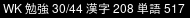

# i3blocks Script for Wanikani

This is a script for i3blocks that fetches your current status from Wanikani
and displays it in the i3 status bar.

It displays the number of open lessons / reviews as well as how many
kanji and words you have already learnt (level Guru or higher).


## Screenshot



The screenshot shows that I have 30 new lessons available and 44 open reviews.
I already learnt 208 kanji and 517 words with Wanikani.


## Usage

To use it you have to specify your Wanikani token (ideally a read-only token)
in a user variable called `$WANIKANI_TOKEN`. How you do this depends on your
setup. For example I define my environment variables in `.xinitrc`, because
I start my desktop with `startx` which executes `.xinitrc`.

If you cannot find out how to setup an environment variable that's available
within your window manager, just edit the `wanikani` script and add
`WANIKANI_TOKEN=<your-token>` to the beginning.

Next, create a block configuration in your `i3blocks.conf`:

```
[wanikani]
command=~/wanikani-i3blocks/wanikani
label=WK
interval=1800
```

You'll have to adjust `command` to where you saved `wanikani`.
